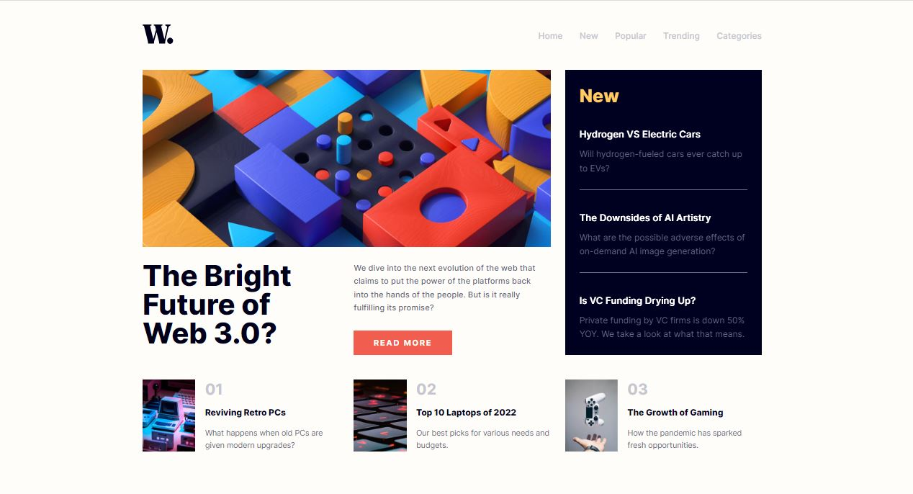

<h1 align="center">news homepage
</h1>

 

   <a href="https://ahlam-alsaffarini.github.io/news-homepage/"> Demo 🔥🤍</a>

   Solution for a challenge from  <a href="https://www.frontendmentor.io/challenges/news-homepage-H6SWTa1MFl" target="_blank">frontendmentor.io</a>.

 
 

## Overview

### The challenge

This is challenge to build out this news website homepage and get it looking as close to the design as possible.

The users should be able to:

- View the optimal layout for the interface depending on their device's screen size
- See hover and click states for all interactive elements on the page

## My process

### Built with

- Semantic HTML5 markup
- CSS custom properties
- Flexbox and Grid system
- Mobile-first workflow

## Acknowledgments

A big thank you to anyone providing feedback on my . It definitely helps to find new ways to code and find easier solutions!
